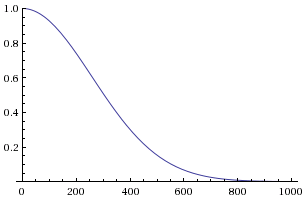
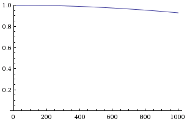
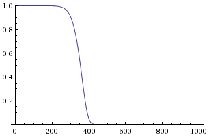
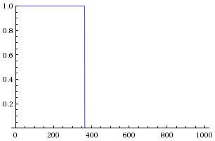

Memopol Scores
~~~~~~~~~~~~~~

Score computation
=================

In Memopol, each representative has a score that shows how their votes match
the recommendations made by administrators on the instance.  The total score
of a representative is the sum of their score on each dossier, which in turn is
the sum of their score on each proposal with a recommendation on the dossier.

Each recommendation made by administrators has a weight: a number that tells how
important a specific proposal is.  When the representative vote on a proposal
matches the recommendation, their score on the proposal is set to +weight.
Otherwise, it is set to -weight.

Score decay parameters
======================

Memopol allows to set decay parameters so that older votes have a lower
importance in the total representative score.  By default, those parameters are
set to values that disable the score decay, so that each vote contributes
identically to the total score no matter how old it is.

The formula used to compute score is the following:

Where:

* ``baseScore`` is the base score for the vote computed as explained above;
* ``voteAge`` is the age of the vote in days;
* ``decayNum`` and ``decayDenom`` define the decay rate;
* ``exponent`` define the steepness of the decay.

The corresponding parameters can be set from the Memopol administration
interface (Memopol Settings > Settings); settings keys are ``SCORE_DECAY_NUM``,
``SCORE_DECAY_DENOM``, ``SCORE_EXPONENT``. Additionnaly, the ``SCORE_DECIMALS``
parameter sets how many decimal places are visible when scores are displayed.

The default values for those settings disable score decay by setting
``SCORE_DECAY_NUM`` to 0, ``SCORE_DECAY_DENOM`` and ``SCORE_EXPONENT`` to 1.

If you want to use score decay, start by setting ``SCORE_DECAY_NUM`` to 1, and
``SCORE_DECAY_DENOM`` to the number of days you want votes to matter.  The graph
below shows how a score of 1.0 will decay with a 1-year decay (the X axis is in
days).

Increasing ``SCORE_DECAY_DENOM`` will make votes matter longer.  Here is the
same example but with a 10-year decay.

Increasing ``SCORE_EXPONENT`` instead will make the decay cutoff steeper.  Here
is an example with a 1-year decay and the exponent set to 6.

Increasing it dramatically will create a brutal cutoff; here is the same example
with the exponent set to 1000:

